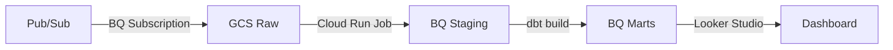

# Technical Writing

## Principles

- Write for a senior engineer maintaining this in 6 months with no prior context.
- Document *why*, not *what*. The code shows what. Comments and docs explain the intent, the trade-offs, the non-obvious constraints.
- Concision over completeness. A short doc that gets read beats a long doc that doesn't.
- English by default. French only if explicitly requested.
- Plain Markdown. No HTML, no custom themes, no emoji in technical docs.

## What NOT to document

These are wastes of tokens that degrade trust in the documentation:

- Obvious code behavior: `# increment counter` above `counter += 1`
- Repetition of the function signature in the docstring
- Historical narrative: "We used to do X but now we do Y because..." — put that in an ADR
- Aspirational statements: "This module will eventually support..." — document what exists
- Author name and date in file headers — that's what git blame is for

---

## README template

```markdown
# <Project Name>

One sentence: what this does and for whom.

## Prerequisites

- Python 3.12+, uv
- GCP project with [list specific APIs enabled]
- [Any other hard requirements]

## Setup

```bash
uv sync
cp .env.example .env
# Edit .env — see .env.example for required vars
gcloud auth application-default login
```

## Usage

```bash
# Most common operation
uv run python -m src.main --date 2026-01-15

# Run tests
uv run pytest
```

## Architecture

[One Mermaid diagram or a 3-5 line description of the data flow. Not a full design doc — that's DESIGN.md.]

## Operations

[Link to runbook if exists. Key failure modes and their fixes. Nothing else.]
```

**Rules:**
- No badges unless the CI is actually configured and passing.
- No "Contributing" section for solo projects.
- No "License" section unless this is public OSS.
- Setup section must be copy-pasteable. Test it.

---

## ADR template

One ADR per significant decision. Stored in `docs/adr/NNNN-short-title.md`.

```markdown
# ADR-NNNN: <Title>

**Date:** YYYY-MM-DD
**Status:** Proposed | Accepted | Deprecated | Superseded by ADR-XXXX

## Context

The problem or constraint that forced this decision. What was the situation?
What options existed? Keep to 3-5 sentences.

## Decision

What we chose and why. One clear statement, then the reasoning.
Reference alternatives considered and why they were rejected.

## Consequences

**Positive:**
- [Concrete benefit]

**Negative / trade-offs:**
- [Concrete cost or limitation]

**Risks:**
- [What could go wrong and how we'd detect it]
```

**Rules:**
- Status must be current. A stale "Proposed" ADR is worse than no ADR.
- Consequences must include at least one negative. If there are none, the analysis is incomplete.
- Cross-reference related ADRs in the footer.

---

## Runbook template

For any pipeline or service running in production.

```markdown
# Runbook: <Pipeline or Service Name>

**Owner:** <team or person>
**Last tested:** YYYY-MM-DD

## What this does

One paragraph. Input → transformation → output.

## Normal operation

What does healthy look like? Expected run duration, row counts, log patterns.

## Failure modes

### <Failure mode 1>
**Symptom:** What you see (log message, alert, metric).
**Cause:** Why it happens.
**Fix:**
```bash
# Exact commands to run
```
**Escalate if:** The fix doesn't work within X minutes.

### <Failure mode 2>
...

## Manual operations

### Re-run a failed partition
```bash
gcloud run jobs execute JOB_NAME \
  --region=europe-west1 \
  --args="--date=2026-01-15"
```

### Check pipeline status
```bash
bq query --use_legacy_sql=false \
  "SELECT * FROM \`project.dataset.pipeline_log\` ORDER BY run_at DESC LIMIT 10"
```
```

---

## Mermaid diagrams

Use for data flows, pipeline architecture, and decision trees. Not for entity-relationship — use a schema file instead.



Rules:
- `flowchart LR` for pipelines (left to right).
- `flowchart TD` for hierarchies (top down).
- Label every arrow with the mechanism, not just the direction.
- Keep diagrams to one logical layer — don't try to show everything in one diagram.

---

## Inline comments

Comment when:
- The code does something counter-intuitive
- A constraint comes from an external system (BQ quota, API rate limit, Airflow behavior)
- A `# noqa` or `type: ignore` is used — always explain why

Do not comment when:
- The code is self-explanatory with good naming
- You're restating the function signature

```python
# BQ charges for bytes scanned at the partition level even with a LIMIT clause.
# This filter on _PARTITIONDATE must come before any JOIN to avoid a full scan.
WHERE _PARTITIONDATE = DATE(run_date)
```

---

## Review checklist

- [ ] README setup section is copy-pasteable and tested
- [ ] No "will eventually" or aspirational statements
- [ ] ADR status is current — no stale "Proposed"
- [ ] ADR consequences include at least one negative
- [ ] Runbook includes exact commands for the most common failure modes
- [ ] Mermaid arrows labeled with mechanism
- [ ] Inline comments explain *why*, not *what*
- [ ] No author/date headers — git blame handles provenance
